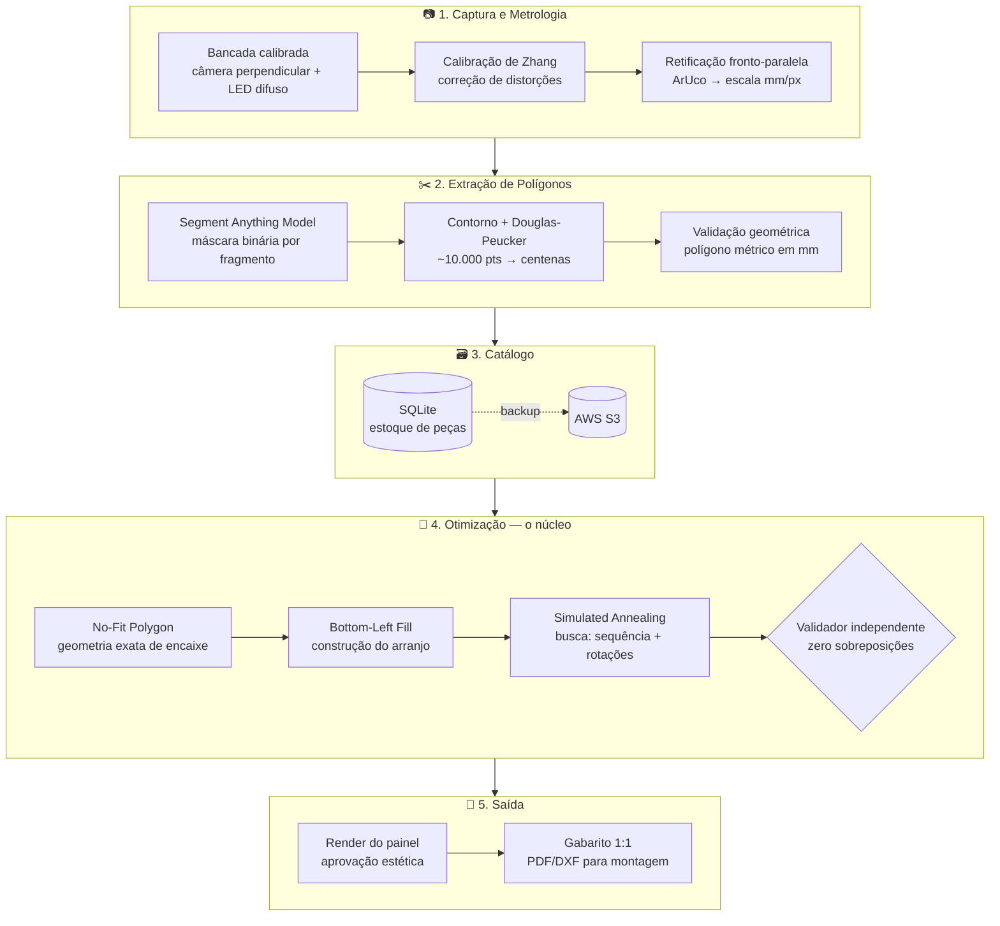

<div align="center">

# 🪨 Petra Smart

### Do retalho ao revestimento: mosaicos de pedra natural otimizados por visão computacional

*Transformando resíduos da indústria de rochas ornamentais em produtos de alto valor estético — automaticamente.*


[**Documentação técnica**](docs/README.md) · [**Gestão do projeto**](gestao/README.md) · [**O problema central**](docs/04-empacotamento.md)

</div>

---

## 💡 O problema

A indústria de rochas ornamentais descarta volumes enormes de **fragmentos irregulares** de mármore, granito e quartzito nas etapas de corte e acabamento. Quando reaproveitados, viram brita ou agregado de concreto — o valor estético do material nobre é destruído. Reaproveitá-los como mosaico preserva esse valor, mas exige encaixar manualmente peças que são **todas únicas**: um trabalho artesanal caro, lento e impossível de escalar.

No fundo, é um problema matemático conhecido e difícil: **empacotamento 2D de polígonos altamente irregulares** (*irregular nesting*) — NP-difícil, sem solução exata viável além de instâncias triviais.

## 🎯 A solução

O Petra Smart fotografa os retalhos em uma bancada calibrada, extrai o contorno real de cada peça em milímetros e calcula automaticamente o melhor arranjo num painel — sem sobreposição, com junta controlada e mínimo desperdício. A saída é um **gabarito de montagem em escala 1:1** que a marmoraria executa diretamente.

```
   retalhos na bancada  ──►  polígonos métricos  ──►  arranjo otimizado  ──►  mosaico físico
        (fotos)              (catálogo digital)          (nesting)             (gabarito 1:1)
```

## 🏗️ Arquitetura



**Regra de ouro do pipeline:** pixel morre no estágio de extração — o empacotamento só enxerga **milímetros**. Toda solução aceita passa por um validador de colisão independente do algoritmo que a gerou.

## ⚙️ Como funciona, em 5 passos

| # | Etapa | Técnica | Por quê |
|---|-------|---------|---------|
| 1 | **Calibrar** | Método de Zhang (OpenCV) + retificação por ArUco | Uma foto vira uma *medição* confiável (erro ≤ 2 mm) |
| 2 | **Segmentar** | SAM (Vision Transformer) | Contorno preciso de qualquer rocha, sem treinar modelo próprio |
| 3 | **Simplificar** | Douglas-Peucker (ε = 0,5 mm) | Centenas de pontos bastam; nesting fica computável |
| 4 | **Empacotar** | NFP + BLF + Simulated Annealing (α = 0,995) | Estado da arte prático para nesting irregular NP-difícil |
| 5 | **Exportar** | Gabarito 1:1 + relatório de aproveitamento | O arranjo digital vira mosaico físico que fecha na montagem |

## 📂 Estrutura do repositório

```
Genesis-Projeto/
├── docs/      📘 Norte técnico do desenvolvimento (arquitetura, algoritmos, métricas, roadmap)
├── gestao/    📋 Gestão do projeto (cronograma, orçamento, compliance, mercado)
├── petra/     🐍 Código-fonte (módulos A–F)          [em construção]
├── ui/        🖥️ Interface de operação               [planejado]
├── tests/     ✅ Unitários + benchmarks versionados  [planejado]
└── data/      🗄️ Amostras locais (fora do git; sync S3)
```

### Documentação técnica (`/docs`)

| Doc | Assunto |
|---|---|
| [01 · Arquitetura](docs/01-arquitetura.md) | Pipeline, contratos entre estágios, decisões em aberto |
| [02 · Calibração](docs/02-calibracao.md) | Zhang, retificação, escala, orçamento de erro (paralaxe!) |
| [03 · Segmentação](docs/03-segmentacao.md) | SAM e variantes, pós-processamento, Douglas-Peucker |
| [04 · Empacotamento](docs/04-empacotamento.md) | ⭐ **Doc central** — NFP, BLF, SA, junta, benchmarks |
| [05 · Dados](docs/05-dados-catalogo.md) | Esquema do catálogo, proveniência, reprodutibilidade |
| [06 · Métricas](docs/06-metricas-tecnicas.md) | Metas numéricas + protocolos de medição |
| [07 · Roadmap](docs/07-roadmap.md) | Módulos A–F com critérios de aceite |
| [08 · Referências](docs/08-referencias.md) | Papers e implementações canônicas |

## 🎯 Metas de qualidade

<div align="center">

| Métrica | Meta |
|---|---|
| Erro dimensional | **≤ 2 mm** (alvo 1 mm) |
| Fidelidade de segmentação (IoU) | **> 0,95** |
| Sobreposições no arranjo | **0** — invariante, não métrica |
| Aproveitamento do painel | **≥ 70%** |
| Tempo de otimização (painel 1 m², ~50 peças) | **< 10 min** |
| Throughput da bancada | **≥ 60 fragmentos/h** |

</div>

## 🧰 Stack

**Visão computacional:** OpenCV (calibração, contornos, ArUco) · PyTorch + SAM (segmentação)
**Geometria:** Shapely 2.x (validação, métricas) · pyclipper/Clipper2 (offset de junta, Minkowski, µm inteiros)
**Dados:** SQLite (catálogo local) · AWS S3 (backup) · AWS EC2 g5.xlarge (lotes GPU)
**Hardware:** iPhone 17 Pro (captura 48 MP + LiDAR) · bancada de captura com iluminação LED controlada

## 🗺️ Roadmap

- [x] Prova de conceito dos algoritmos (pré-projeto)
- [x] Documentação técnica completa (`/docs`)
- [ ] **Módulo A — Calibração e metrologia** ← em desenvolvimento
- [ ] Módulo B — Segmentação (SAM → polígono métrico)
- [ ] Módulo C — Catálogo de fragmentos
- [ ] Módulo D — Empacotamento (NFP + BLF + SA)
- [ ] Módulo E — Interface de operação
- [ ] Módulo F — Exportação e gabarito 1:1
- [ ] Testes piloto com marmorarias parceiras
- [ ] Painéis-demonstração físicos

## 👥 Equipe

| Papel | Nome |
|---|---|
| Coordenador | **Marcos Antonio Mendes Paes** |
| Equipe | Igor Henrique Beloti Pizetta · Dullye Noleto Lima Teixeira |

## 🤝 Apoio

<div align="center">

Projeto contemplado pelo **Programa Gênesis** — Edital FAPES nº 09/2025 (microrregião Central-Sul/ES),
com subvenção econômica da **FAPES — Fundação de Amparo à Pesquisa e Inovação do Espírito Santo** / FUNCITEC.

*Cachoeiro de Itapemirim — capital secreta do mármore e granito.* 🇧🇷

</div>

## 📄 Licença

Distribuído sob a licença **GPL-3.0**. Veja [LICENSE](LICENSE).
